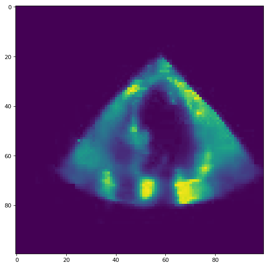

# Adavanced machine learning 2018

This repository contains our solutions of for 5 projects of the AML class at ETH.

## TASK 1

### Approach


In our final pipeline design, which we used for our best prediction, we started by filling in the Nan values in the data by computing the mean per feature. 
In the second step, we removed the mean and divided by the standard deviation to whiten the data.

In the third step, we reduced the amount of feature by computing the importance of each feature with univariate linear regression tests and a random forest regressor. After sorting this two list, we computed the union of the first 150 features from the linear regression tests and 100 of the random forest regressor and ended up with the 180 most important features.

The final regression was done by a neural network with a depth of 10 and a width of 80. Each layer was a dense layer followed by a leaky ReLu and a dropout layer to prevent overfitting.  As a loss function, we use the mean squared error and as an optimizer, we use Adam with a learning rate of 0.01.  We trained the network for 40 epochs and randomly shuffled the input each time.

## TASK 2 DISEASE CLASSIFICATION FROM IMAGE FEATURES

This task is primarily concerned with multi-class classification where you have 3 classes. However, we have changed the original image features in several ways. You will need to deal with class imbalance; in the training set, there are 600 examples from class 0 and 2 but 3600 examples from class 1. Test set has the same class imbalance as the training set.

### Approach


For our best submission, we took the raw data, without any preprocessing or feature selection and used a Support Vector Machines for classification.  

To determine the best parameters for our models we used Bayesian optimization with around 200 iterations. 
In each iteration, we used K-fold cross-validation with k equal to 10 and to determine the error we computed 
the average of balanced accuracy score of each fold. By applying this method we determined the optimal class 
weights for the loss function for our unbalanced classification problem.  

For the final classifications, we used the 3 most promising weights and constructed 3 different SVC. Each SVC is using radial basis function with gamma defined as one divided by the number of features and the one vs rest approach. To classify a sample we implemented a majority voting. As a heuristic, if there is a tie between the 3 classifiers, we pick the class with the highest predicted probability.

Public score: 0.719508717415

Private score: 0.698333333333

## TASK 3

### Approach


For our final submission, we started extracting a feature vector from each signal. To achieve this task we relayed on the library BioSPPy [https://biosppy.readthedocs.io/en/stable/] to extracted meaningful features of the ECG signal. 
The after running the ECG function with the raw signal we got certain information, like the position of r peaks or the heart rate of the input.

To construct our final feature vector used for further processing, we added the min, max and mean of signal value of the r peaks, the heart rate and the signal templates, which are basically the single heartbeats of the input signal. 
Additional to the plain output of the ECG function, we computed the first order difference is given by out[n] = a[n+1] - a[n] for r peaks, the heart rate and the timestamps of the heart rate. From this difference, we saved the mean, min and max into our feature vector. To get a better measurement for a noisy signal we added the sum of differences between the raw and the clean signal. Finally, we added the min, max and mean of each heartbeat to the signal. 

For our final prediction, we scaled the data using the standard scaler and input it into a gradient boosting classifier with a maximal depth of 5 and 100 estimators.

## TASK 4

### Approach



For our final submission, we decided to split up each video into segments of 22 frames, since the shortest video in our train and test set has 22 frames. 
The next step in our pipeline is to extract a feature vector for every snipped. 
We start by summing up the pixel values of each frame, to obtain some kind of heartbeat approximation. Afterwards, we compute the min, max, mean and std of that function and append it to the feature vector, as well as the function itself. Additionally, we add the mean, std and the non_zero entries of both the column and the row-wise pixels of the video. Finally, we compute the difference between two following frame to get a measure for the change in pixel intensity. From this measurement, we use again the row and column-wise mean, std and non zero counts as well as the mean and std of the framewise sum. This result in a 13872-dimensional feature vector, on which we perform feature selection with a random forest regressor with 10000 estimators, resulting into a 2233 dimensional vector. 
This vector is scaled using the standard scalar and used to train a random forest regressor with 2000 estimators.

We remove the row and column wise mean and std from the original vector and end up with 667 dimensions, which are used to train a gradient boosting regressor with 100 estimators and a max depth of 5.

The final prediction is done by averaging the probabilities of both regressors. 

## TASK 5: SLEEP STAGING FROM EEG/EMG

In this task we will perform sequence classification. We will categorize temporally coherent and uniformly distributed short sections of a long time-series. In particular, for each 4 seconds of a lengthy EEG/EMG measurement of brain activity recorded during sleep, we will assign one of the 3 classes corresponding to the sleep stage present within the evaluated epoch.

### Approach


For the final project, we started extracting features from every 4-second segment. For the EMG signal, we took the Root Mean Square error with the zero vector, the integrated absolute value, Mean absolute value, the simple squared integral, the variance, 3rd, 4th and 5th temporal moments, the waveform length, the average amplitude change, difference absolute standard deviation value, the standard deviation, the minimum and max value and the count of value above epsilon (0.0002). For both EEG signals, we took the Petrosian Fractal Dimension, the Higuchi Fractal Dimension, the Fisher Information, the Detrended Fluctuation Analysis, the mean, the standard deviation, the minimum and max value and the count of value above epsilon (0.0002). Additionally, we added the band power of the alpha, beta, delta and theta wave as a feature, as well as the scaled version by the total signal energy. 
This resulted in a 49-dimensional feature vector per segment. For the classification, we used a majority voting scheme build with 3 classifiers. A SVC with balanced weights,  gamma = 0.004 and C = 0.01. A LSTM with 3 LSTM layers, with 32 stateful nodes and a dropout of 0.2 and a dense softmax classification layer. 
A linear Chain Conditional Random Field with structured SVM solver with a 1-slack QP with L1 slack penalty. 
As a post-processing step, a median filter is applied after each classifier is doing the predictions and after the majority voting.

Public score: 0.937262129734

Private score: 0.91728428545

## Required software and installation

1. [Pycharm Professional](https://www.jetbrains.com/pycharm/): Python IDE used for development and debugging.
2. [Anaconda3](https://www.anaconda.com/download/): Python Data Science Platform, used for the Conda environment variables.

## Setting up the environment
After installing the required software, you must setup the environment. This can be done by one of these two methods:

**IMPORTANT**:
add export PYTHONHASHSEED=42 to your .bashrc file to get always reproducable results

### Importing an environment
This will create the new conda environment "aml" and install all the required software.
#### Linux (CPU)
Import the [environment.yml](../blob/master/environment.yml). To do so open a terminal and type the following command 
 
```
conda env create -f environment.yml
```
### Activating the environment
To install new libraries or modify the environment you must first activate the environment.
#### Linux
Launch a terminal, and issue this command
```
conda activate aml
```

### Jupyter-notebook
If you want to use the environment in the a notebook as a kernel run:
```
python -m ipykernel install --user --name aml --display-name "Python3 (aml)"
```

### Installing new libraries
After activating the environment in a terminal in Linux, or the Anaconda prompt in Windows, you can install new packages by issuing this command
```
conda install <package name>
```

### Changing the PyCharm interpreter
The steps are almost the same for Linux and Windows:
1. Open the project folder *AML* in PyCharm
2. Go to "**File>Settings**"
3. From the tabs on the left select "**Project:AML**" then **Project Interpreter**
4. Click on the **Gear** symbol (Settings) next to the list of available interpreters, and then **Add...**
5. In the pop-up window, select "**Existing environment**", then the "**...**" button next to the "**interpreter**" list.
6. Navigate to the location of the new conda environment you created, by default it is located in (/home/<USER>/Anaconda3/bin/python) for Linux and (C:\Users\<USER>\Anaconda3\python.exe) for Windows.

This should make Pycharm use the conda environment we created called **aml** for this project.

## Running the project
First, load the projects environment, you can do so through PyCharm or using the terminal (Anaconda prompt for Windows):  
```
conda activate aml
cd /path/to/project
```
